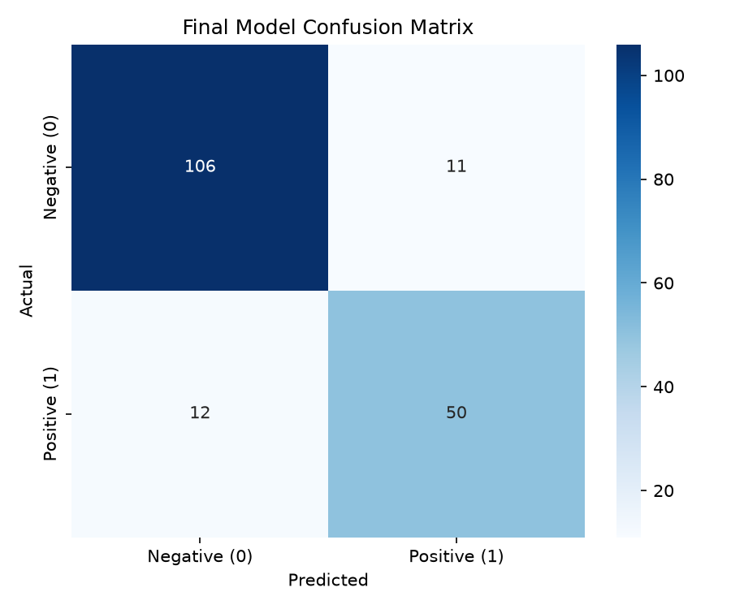

# Play Store Review Sentiment Model Evaluation Report

## Dataset Summary

- Total valid reviews: 891
- Negative reviews (0): 584
- Positive reviews (1): 307
- Source file: `data/raw/playstore_reviews.csv`

## Preprocessing and Split Settings

- Review cleaning: `df["review"] = df["review"].str.strip().str.lower()`
- Train/test split: 80/20 stratified split
- Random state: 42
- Primary selection metric: positive-class F1 (`pos_label=1`)
- Tie-breaker: accuracy

## Baseline Holdout Results (CountVectorizer, unigrams)

| Model | Accuracy | Precision | Recall | F1 (pos) |
| --- | ---: | ---: | ---: | ---: |
| MultinomialNB | 0.8547 | 0.8913 | 0.6613 | 0.7593 |
| LogisticRegression | 0.8324 | 0.7500 | 0.7742 | 0.7619 |
| GaussianNB | 0.8156 | 0.7636 | 0.6774 | 0.7179 |
| RandomForestClassifier | 0.8045 | 0.6800 | 0.8226 | 0.7445 |
| LinearSVC | 0.7933 | 0.6812 | 0.7581 | 0.7176 |
| BernoulliNB | 0.7821 | 0.8710 | 0.4355 | 0.5806 |

- Best Naive Bayes model: **MultinomialNB**

## Enhanced Candidate Results

Vectorizer and model combinations were tuned with `5`-fold stratified cross-validation on the training split only.
The table shows only holdout accuracy, precision, recall, and F1 for each tuned candidate.
Cross-validation remains internal to model selection; for readability, this diagnostic table is ordered by holdout accuracy and then holdout F1.

| Candidate | Holdout Accuracy | Holdout Precision | Holdout Recall | Holdout F1 |
| --- | ---: | ---: | ---: | ---: |
| LinearSVC__tfidf_unigram | 0.8715 | 0.8197 | 0.8065 | 0.8130 |
| LinearSVC__tfidf_bigram | 0.8659 | 0.8393 | 0.7581 | 0.7966 |
| LogisticRegression__tfidf_unigram | 0.8603 | 0.8033 | 0.7903 | 0.7967 |
| LogisticRegression__tfidf_bigram | 0.8603 | 0.8033 | 0.7903 | 0.7967 |
| MultinomialNB__count_bigram | 0.8603 | 0.8364 | 0.7419 | 0.7863 |
| MultinomialNB__count_unigram | 0.8547 | 0.8462 | 0.7097 | 0.7719 |
| BernoulliNB__count_bigram | 0.8492 | 0.7692 | 0.8065 | 0.7874 |
| BernoulliNB__tfidf_bigram | 0.8492 | 0.7692 | 0.8065 | 0.7874 |
| MultinomialNB__tfidf_bigram | 0.8492 | 0.9268 | 0.6129 | 0.7379 |
| LogisticRegression__count_bigram | 0.8436 | 0.7742 | 0.7742 | 0.7742 |
| RandomForestClassifier__count_bigram | 0.8436 | 0.7742 | 0.7742 | 0.7742 |
| BernoulliNB__count_unigram | 0.8436 | 0.7931 | 0.7419 | 0.7667 |
| BernoulliNB__tfidf_unigram | 0.8436 | 0.7931 | 0.7419 | 0.7667 |
| LinearSVC__count_bigram | 0.8380 | 0.7619 | 0.7742 | 0.7680 |
| RandomForestClassifier__count_unigram | 0.8324 | 0.7353 | 0.8065 | 0.7692 |
| MultinomialNB__tfidf_unigram | 0.8268 | 0.8605 | 0.5968 | 0.7048 |
| LogisticRegression__count_unigram | 0.8212 | 0.7273 | 0.7742 | 0.7500 |
| LinearSVC__count_unigram | 0.8212 | 0.7344 | 0.7581 | 0.7460 |
| RandomForestClassifier__tfidf_unigram | 0.8156 | 0.7164 | 0.7742 | 0.7442 |
| RandomForestClassifier__tfidf_bigram | 0.7989 | 0.6912 | 0.7581 | 0.7231 |

- Best CV candidate: **LinearSVC__tfidf_unigram**
- Best CV params: `{'model__C': 0.1}`
- Highest diagnostic holdout accuracy: **LinearSVC__tfidf_unigram** (0.8715)

## Final Selected Model

- Selected model: **LinearSVC__tfidf_unigram**
- Selection rationale: Selected LinearSVC__tfidf_unigram using the highest mean training-set CV positive-class F1 (0.7360), with CV accuracy as the tie-breaker. Its holdout F1 (0.8130) is reported as an out-of-sample evaluation and was not used for selection.
- Holdout accuracy: 0.8715
- Holdout precision (positive): 0.8197
- Holdout recall (positive): 0.8065
- Holdout F1 (positive): 0.8130

### Final Holdout Confusion Matrix



```
[[106, 11], [12, 50]]
```

### Final Classification Report

```json
{
  "0": {
    "precision": 0.8983050847457628,
    "recall": 0.905982905982906,
    "f1-score": 0.902127659574468,
    "support": 117.0
  },
  "1": {
    "precision": 0.819672131147541,
    "recall": 0.8064516129032258,
    "f1-score": 0.8130081300813008,
    "support": 62.0
  },
  "accuracy": 0.8715083798882681,
  "macro avg": {
    "precision": 0.8589886079466519,
    "recall": 0.8562172594430659,
    "f1-score": 0.8575678948278844,
    "support": 179.0
  },
  "weighted avg": {
    "precision": 0.8710690896447026,
    "recall": 0.8715083798882681,
    "f1-score": 0.871259442655047,
    "support": 179.0
  }
}
```

## Misclassified Holdout Reviews

From the confusion matrix above: **11 false positives** and **12 false negatives**.

Many errors are mixed-sentiment reviews (praise plus complaints) or borderline labels.

### False positives — labeled negative (0), predicted positive (1) (11)

1. the new theme is not compatible with my device :( (samsung galaxy j1) make it compatible please. i really love this game.

2. i used to play this game almost 5 years ago and it was my absolute favorite! i recently re-installed it and i got to say, it's very slow and this will be the third time in less than a month that i've lost my boosters.... i have paid for them and it gets taken out of my account but i still don't have them!! i really love this game, please fix the app because it's such a great game. get with the program guys, it's just so slow! besides that we love this game.

3. mark i found viber to be extremely efficient way to communicate with my loved one. i have skype as well but it's not as good as viber.

4. was great i was going to give this 5 stars until the latest update causes it to constantly crash and force close. please fix it! i love playing this game!

5. always fun, but... i like this new frozen shadows, but the depth perception is not so good. it's hard to see an approaching corner. other then that small bug, i love this game and will continue to play it.

6. awesome game but... this is such a great game but there are way to many adds every time you get passed a level there's another add but even with all the adds it's still an amazing game

7. no upgrades to the game till yet...the developers have no idea how to do upgrades.... most of the people have stopped playing it because it got old and there is no fun playing it now...

8. neat idea, but let-down by no linux support. an application like evernote is only as useful as the service behind it, and the service behind a concept like evernote is only as useful as the availability of an application or program to connect to said service... which is where evernote fails - it is not natively available for linux-based operating systems (such as ubuntu). sure, the android application works well enough - but when the only way to access evernote under a linux-based operating system is via a web browser, it quickly looses its appeal.

9. why what's app does not support same account on multiple devices that's security but that's not good i buy a new phn sometimes i used to go with any phn then i have to switch to that that's not good should support same account on multiple devices

10. often painfully slow. needs a useful tablet ui, quick reply, and the ability to send video. some of these are features the ios version has had for almost 2 years and that isn't really excusable from the company that runs android. this is the kind of thing that makes people switch to ios or makes android phone lovers buy ipads instead of android tablets.

11. it's useful a great app and pretty much an essential part of my organization. a minor complaint is that the desktop program doesn't look as appealing as the mobile app, and that the mobile version is lacking some useful functions (e.g. the ability to delete tags, or to strikethrough text).

### False negatives — labeled positive (1), predicted negative (0) (12)

1. great features, but my notifications don't work title says it all, the app says i should be getting the notifications on my phone but i'm not getting any. would rate 5 stars if this was resolved.

2. installed and immediately deleted this crap i have used firefox on my desktop for longer then i can remember and i will continue to only use it on my desktop. your only options for a homepage are the crap they want you to see or a blank page with nothing on it and you can't go to a bookmarked website unless you want to go back to their crappy homepage just to see your bookmark list.  and did i mention it's crap?

3. it's alright😤 i don't get to go on the cross wire i've got to 200 000 why why why.,😢💀💀💀💀⚠⚠⚠🉐🈵🈺🉑㊙🉐🔇i forgot to tell u no sound on this game ........i hate it

4. uc hello uc browser i  start uc browser it s open when i type search bar web address it s loading loading it s not showing any thing but if i use vpn its working well  it happen oman lost 2 week so kindly find the solution

5. too many ads far more adverts than any other game i've played. i know it's free and they need the ads to make a profit but there needs to be a balance.

6. umm.... while this game has gotten kinda old, and i've basically replaced it with the soda saga game, i still like playing this but for some reason, for i don't know how many days now, every time i go to open this game it'll load a little and then crash closed. fix please!!!!!!!!

7. almost, but not quite. this has so much potential, but i really would like a back function that works, i press back and wait, nothing happens. i press back again and it takes me to the homepage,  same for the back button on the tablet,  i'm using a 1st gen nexus 7.

8. viber s.a.r.l. this app helps me to stay in contact while also having video options and picture options. really nice app and pretty stable running. just a few video and audio issues as well as video and call drops which can be annoying. sometimes the app is unstable but is mostly attributed to network issues rather than the app itself. i recommend this app.

9. really cool and organized. the new update is really amazing, the widgets are cool, however, it would be helpful if you could add right to left reading and writing support (like hebrew, 'cause when i want to add check box the text removed to the left). also, you need to add an option to change the size of the preview (don't like it's so small), and app animations would be nice. something else to your attention: i want to by the app, but it really (really) expensive. if it was cheaper and one time charge i would buy it.

10. i got my opera back. i can see videos now. to me no one wsa better than opera,perhaps there headed there again. thankyou opera. just found single colume view. ok your number one

11. fastest browser it's fast, it's reliable, the only problem i have with it, it don't like to download video's or game's. so both video's & game's it goes to the site just no downloads come up & also the lil emoji's that have action to them, it don't show their lil action. i would give a 5 star rating but until then a 3 star is all. i hate that to cause this really is a fast browser, maybe the fastest. so please fix those bugs!

12. know how to get the account back. you have to delete clash of clans,then you download it again, then you look on the upper left corner of the screen, then you see already have a village?'' then you press it,then you will have your village.

## Conclusion

The final model was selected by mean positive-class F1 from training-only cross-validation, with CV accuracy as a tie-breaker. Among the Naive Bayes variants, **MultinomialNB** performed best on the required baseline comparison. After enhanced tuning with Count/TF-IDF features and unigram/bigram ranges, **LinearSVC__tfidf_unigram** was chosen as the production artifact. Its holdout metrics estimate out-of-sample performance; the per-candidate holdout metrics above are diagnostic comparisons and did not control model selection.
